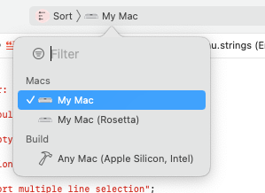

# Sort_service

macOS service to sort the lines of the selection

It lives in the **Services** submenu of the current application's first menu.

## To Build:

* Set the **Destination** as appropriate for your Mac. For example, on an Apple Silicon Mac:

* Open the Xcode project and in the Info panel of the Sort target change the `com.example` prefix of the bundle Identifier from `com.example.${PRODUCT_NAME:rfc1034identifier}`  to a domain you control.

* You may choose to adjust how the code is signed, but that isn't necessary.

* **Build** from the **Product** menu

## To Install:

* from the **Products** group in Xcode's **Product Navigator** select  `Sort.service` and right-click to **Show in Finder** In the Finder, put   `Sort.service` in your `Library/Services` directory.
(Hold to the Option key on the Finder's 'Go' menu to find your Library folder.)

Ventura and newer: In **Settings** > **Keyboard** > **Keyboard Shortcuts** > **Services** in the **Text** section check the checkbox to enable **Sort**. Click on the right edge of its table row to add a command-key-equivalent.

Older: In **System Preferences** > **Keyboard** >  **Shortcuts** > **Services**  in the **Text** section check the checkbox to enable **Sort**. Click on the right edge of its table row to add a command-key-equivalent.

## To Use:

In any program that uses Apple's text system, select multiple lines.  Choose **Sort** from **Services** submenu.

## License

• Apache license version 2

